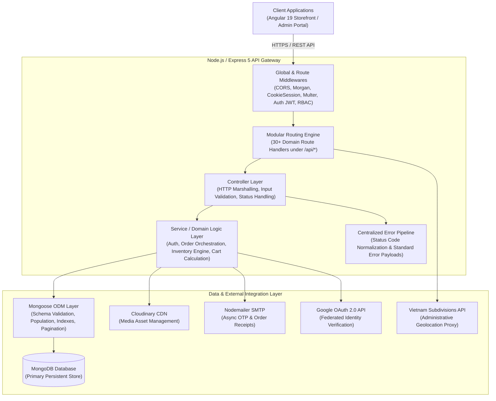
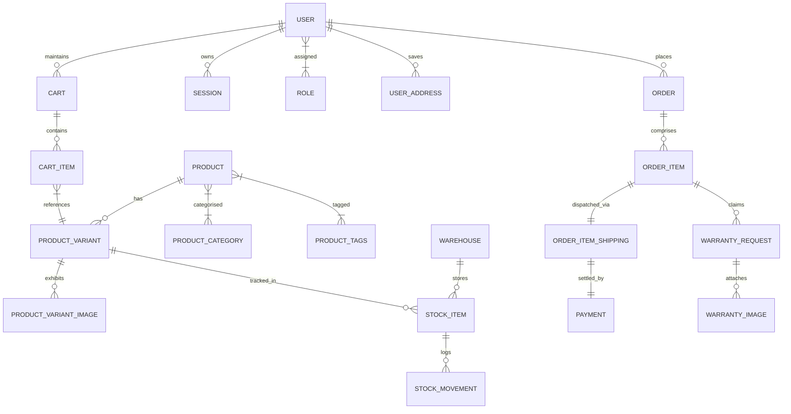
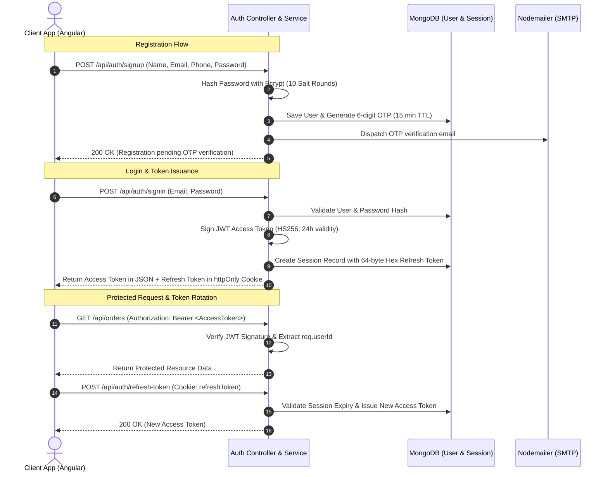

# 🛋️ Furniture E-Commerce — Backend Architecture & System Design

> **Production-grade RESTful API backend for a modern, multi-vendor furniture e-commerce ecosystem, engineered with Node.js, Express 5, MongoDB, and Mongoose ODM.**

---

## 📑 Table of Contents

1. [Architectural Overview](#1-architectural-overview)
2. [Core Backend Services & Modules](#2-core-backend-services--modules)
3. [API Design & Routing](#3-api-design--routing)
4. [Database & Data Layer](#4-database--data-layer)
5. [Security, Authentication & Asynchronous Flows](#5-security-authentication--asynchronous-flows)
6. [Engineering Highlights & Resume Bullet Points](#6-engineering-highlights--resume-bullet-points)
7. [Getting Started & Configuration](#7-getting-started--configuration)

---

## 1. Architectural Overview

The backend is engineered around a **Decoupled Client-Server Architecture** utilizing a **Layered MVC + Service Pattern (Controller-Service-Repository)**. It exposes a modular, high-throughput RESTful API designed to serve both client-facing storefronts (Angular SPA) and back-office administration dashboards.



### Key Architectural Characteristics

- **Separation of Concerns (SoC):** Controllers remain lightweight, delegating complex transactional logic, multi-model orchestrations, and aggregate computations to isolated service classes (`AuthService`, `OrderService`, `ProductService`, `StockItemService`, etc.).
- **Stateless API Gateway with Stateful Refresh Sessions:** Access tokens are signed JWTs passed via `Authorization: Bearer` headers, while refresh tokens are cryptographically generated random hex strings persisted in MongoDB and exchanged via `httpOnly` secure cookies.
- **Fail-Safe Third-Party Proxying:** Internal reverse proxying for Vietnam administrative division endpoints (`/provinces`, `/provinces/:id`) to prevent CORS friction on frontend clients and maintain unified networking topology.
- **Interactive OpenAPI Specification:** Built-in Swagger UI integration served at `/api-docs` reading from an OpenAPI 3.0 schema definition for cross-team contract validation.

---

## 2. Core Backend Services & Modules

```
backend/
├── app/
│   ├── config/              # Infrastructure configs (DB connection, Cloudinary, Auth secrets)
│   ├── controllers/         # 28 HTTP controllers managing domain endpoints
│   └── models/              # 35 Mongoose schemas with relational references & indexes
├── constants/               # Global HTTP status codes, error definitions, user roles
├── middlewares/             # JWT verifiers, RBAC guards, SignUp validators, Multer, Error handlers
├── routes/                  # 31 domain-specific REST route definitions
├── services/                # 9 core business logic engines
├── templates/               # Responsive HTML email templates for transactional delivery
├── utils/                   # Shared helpers (Cloudinary uploader, slugifiers, pagination, VND formatter)
└── server.js                # Application entrypoint & HTTP server bootstrap
```

### Domain Modules & Business Logic Services

| Module / Service | Key Responsibilities & Engineering Implementation |
| :--- | :--- |
| **Authentication Service**<br/>`auth.service.js` | <ul><li>Dual-authentication workflow: Standard email/password with **bcrypt** (10 salt rounds) and **Google OAuth 2.0** federated identity verification.</li><li>6-digit time-bound (15-minute TTL) OTP generation for email account activation and password resets via SMTP.</li><li>Token lifecycle management: 24-hour Access Token (`HS256`) and 15-day sliding Refresh Token stored in MongoDB `Session` collection.</li></ul> |
| **Order Orchestration Engine**<br/>`order.service.js` | <ul><li>Dual checkout pipelines: Authenticated (`checkout`) and Guest (`checkoutWithoutLogin`).</li><li>Computes multi-item financial breakdowns (`before_total`, `discount_total`, `total_shipping_fee`, `total_amount`).</li><li>Coordinates multi-entity creation: `Order` $\rightarrow$ `OrderItem[]` $\rightarrow$ `OrderItemShipping` $\rightarrow$ `Payment`.</li><li>Triggers real-time stock allocation/deduction and customer loyalty reward point calculation.</li><li>Compiles and dispatches localized dynamic HTML order confirmation receipts.</li></ul> |
| **Inventory & Stock Engine**<br/>`stock.service.js` | <ul><li>Warehouse-level SKU inventory tracking with separated counters (`quantity_on_hand`, `quantity_reserved`).</li><li>Atomic concurrency-safe inventory operations using MongoDB `$inc` operators.</li><li>Supports a two-phase stock reservation workflow: `reserveStock` $\rightarrow$ `confirmStock` (or `releaseReservedStock` on order cancellation).</li></ul> |
| **Product Catalog & Variant Engine**<br/>`product.service.js` | <ul><li>Hierarchical product-to-variant-to-image modeling with default variant and main image resolution.</li><li>Dynamic measurement properties schema (`measurement: Mixed`) accommodating irregular furniture dimensions (height, width, seating height, diameter).</li><li>Real-time incremental rating aggregation algorithms updating `rating.average` and `rating.count`.</li><li>Text-indexed keyword matching and category slug traversal.</li></ul> |
| **Cart & Pricing Service**<br/>`cart.service.js` | <ul><li>Persistent per-user active cart session management.</li><li>Live subtotal and promotional discount recalculation upon item mutation.</li><li>Optimized aggregate cleanup upon checkout completion.</li></ul> |
| **Warranty & Post-Purchase Subsystem**<br/>`warranty.controller.js` | <ul><li>Customer warranty claim lifecycle (`pending` $\rightarrow$ `approved`/`rejected` $\rightarrow$ `resolved`).</li><li>Multi-image attachment handling via Multer buffer into Cloudinary CDN storage with automated URL association.</li></ul> |
| **User Loyalty & Point System**<br/>`user.service.js` | <ul><li>Gamified customer reward algorithm automatically incrementing loyalty points based on total order spend tiers.</li></ul> |

---

## 3. API Design & Routing

### RESTful Routing Architecture

The routing topology is organized under `/api/*` for client operations and `/api/admin/*` for role-restricted administrative endpoints. Over **30 modular sub-routers** are registered into the main Express application:

```text
/api
├── /auth                     # SignUp, SignIn, Google OAuth2, Token Refresh, OTP Verification, Password Reset
├── /products                 # Catalog browsing, Category filtering, New Arrivals, Best Sellers, Search
├── /admin/products           # Product CRUD, Variant creation, Tag associations (Admin/Moderator)
├── /orders                   # User checkout, Order history, Order cancellation
├── /admin/purchase-orders    # Supply chain purchase order management
├── /cart                     # Item addition, Quantity mutations, Active cart calculation
├── /stock-items              # Warehouse inventory queries, Quantity reservations
├── /stock-movements          # Inventory in/out transaction logging
├── /warehouse                # Warehouse facility CRUD
├── /warranties               # Claim creation, Multi-image uploads, Admin resolution status
├── /inquiries                # Customer service tickets and support messages
├── /reviews                  # Product variant reviews & rating calculations
├── /admin/vouchers           # Discount voucher creation and management
├── /promotions               # Active promotional campaign endpoints
├── /addresses                # Customer shipping address book
├── /payment-methods          # Saved payment preferences & configurations
├── /blogs & /blog-categories # Content marketing, Articles, Authors, Tags
├── /events & /register-events# Marketing workshops & in-store customer event bookings
└── /upload                   # Multipart image upload to Cloudinary CDN
```

### Request Processing & Pagination

Standardized offset-based pagination helper (`getPagination`) integrated with `mongoose-paginate-v2`:
```javascript
// Request: GET /api/products?page=1&size=20&title=sofa
const { limit, offset } = getPagination(page, size);
const products = await Product.paginate(condition, { offset, limit });
```

### Unified Response & Error Handling Pipeline

1. **Standardized Success Envelope:**
   ```json
   {
     "message": "Operation completed successfully",
     "data": { ... }
   }
   ```
2. **Centralized Error Normalization Middleware (`errorHandler.js`):**
   Catches operational and unhandled exceptions, mapping them against predefined HTTP constants:

   | Status Constant | Code | Description |
   | :--- | :--- | :--- |
   | `VALIDATION_ERROR` | `400` | Malformed body, missing required fields, schema validation failure |
   | `UNAUTHORIZED` | `401` | Missing/expired JWT access token, invalid credentials |
   | `FORBIDDEN` | `403` | Insufficient RBAC permissions (e.g. non-admin accessing `/admin/*`) |
   | `NOT_FOUND` | `404` | Entity lookup failure (Product, Order, User not found) |
   | `SERVER_ERROR` | `500` | Unhandled runtime errors, database connectivity drops |

---

## 4. Database & Data Layer

### MongoDB & Mongoose ODM Design Strategy

The data layer leverages MongoDB for flexible document storage while enforcing structural integrity via **Mongoose Schemas**, strict typing, relationship population, and lifecycle hooks.



### Data Modeling Highlights

- **Normalized Relational References with Deep Population:**
  Entities with high cardinality (e.g., `Order` $\rightarrow$ `OrderItem` $\rightarrow$ `OrderItemShipping` $\rightarrow$ `Payment`) are normalized using `mongoose.Schema.Types.ObjectId` references (`ref`), preventing single-document 16MB BSON size limit breaches and enabling granular document locking.
- **Dynamic Polymorphic Attributes (`Mixed` Schemas):**
  Furniture specifications differ wildly across categories (e.g., sofas have *seating height* and *fabric density*, tables have *load capacity* and *diameter*). The `ProductVariant.measurement` and `Product.product_component` fields utilize `mongoose.Schema.Types.Mixed` to store dynamic, extensible JSON metadata without schema migrations.
- **Indexing Strategy:**
  - **Text Search Compound Index:** `productSchema.index({ product_name: "text", tags: "text" })` enables fast full-text keyword querying.
  - **Filter & Sorting Indexes:** Single-field and compound indexes on `ProductVariant.price`, `ProductVariant.product`, `ProductVariant.sku` (unique), and `User.email` (unique).
- **Auto-Bootstrapping Seed Layer:**
  On database connection establishment, the application checks `Role.estimatedDocumentCount()` and automatically seeds essential system roles (`user`, `moderator`, `admin`) to prevent cold-start authorization failures.

---

## 5. Security, Authentication & Asynchronous Flows

### 1. Dual-Token Authentication & Session Management



### 2. Role-Based Access Control (RBAC) Pipeline

Middleware guards are chained directly onto sensitive administrative routes:
- `verifyToken` / `protectedRoute`: Validates JWT integrity, extracts subject (`userId`), and attaches to the Express request context.
- `isAdmin`: Resolves user role IDs against the `Role` collection to enforce administrator-only execution.
- `isModerator`: Enforces content moderation rights for blog and review management.
- `verifySignUp`: Pre-validates email uniqueness and prevents arbitrary privilege escalation during registration.

### 3. Asynchronous Workflows & Third-Party Pipelines

- **Multipart File Upload Pipeline (Cloudinary CDN):**
  Files intercepted by `multer.diskStorage` are validated against MIME types (`image/*`), staged in a local temporary directory (`tmp/`), streamed to Cloudinary using secure HTTPS SDK uploaders, and immediately mapped to cloud asset URLs before local temp cleanup.
- **Transactional Email Notifications:**
  Background non-blocking emails powered by `nodemailer` with Gmail SMTP transport:
  - Account Activation OTPs.
  - Password Reset OTP authorization codes.
  - Rich HTML Order Confirmation receipts with order itemization, shipping fee breakdowns, and tracking links.

---

## 6. Engineering Highlights & Resume Bullet Points

> *Tailored technical accomplishments for software engineering portfolios and resumes:*

- **Engineered a scalable, modular e-commerce RESTful API backend** using Node.js, Express 5, and MongoDB/Mongoose, powering catalog, multi-warehouse inventory, checkout, warranty, and customer loyalty subsystems.
- **Architected a robust dual-token authentication system** combining short-lived JWTs (HS256) with cryptographically secure, `httpOnly` cookie-based refresh tokens in MongoDB, achieving secure session persistence and defense against XSS/CSRF.
- **Integrated Google OAuth 2.0 Identity Services** via `google-auth-library` ID token verification for seamless federated single sign-on (SSO) and automatic account provisioning.
- **Implemented a two-phase inventory reservation engine** with atomic MongoDB `$inc` operators, preventing race conditions, stock overselling, and inconsistencies during concurrent checkout spikes.
- **Designed a dynamic data model for irregular furniture specifications** using Mongoose `Mixed` schemas and compound text search indexes, optimizing search and filtering across tens of product variants.
- **Built an automated transactional email pipeline** using Nodemailer and dynamic HTML templating for time-bound 6-digit OTP delivery and order receipt generation.
- **Engineered an asynchronous media processing pipeline** leveraging Multer disk staging and Cloudinary API SDKs for image uploads and CDN hosting across catalog and warranty modules.
- **Authored comprehensive API contracts with Swagger / OpenAPI 3.0**, enabling cross-functional integration with frontend teams.

---

## 7. Getting Started & Configuration

### Prerequisites
- **Node.js**: `v18.x` or higher
- **MongoDB**: Local instance or MongoDB Atlas cluster connection URI
- **Cloudinary Account**: Cloud name, API key, and Secret for asset storage
- **Gmail App Password**: For SMTP transactional email delivery

### Environment Variables (`.env`)

Create a `.env` file inside the `backend/` directory:

```env
PORT=5001
DATABASE_URL=mongodb+srv://<username>:<password>@cluster.mongodb.net/furniture_db?retryWrites=true&w=majority
AUTH_SECRET=your_super_secret_jwt_key
SECRET_KEY=your_cookie_session_secret

# Google OAuth 2.0
GOOGLE_CLIENT_ID=your_google_client_id.apps.googleusercontent.com

# Cloudinary CDN
CLOUDINARY_CLOUD_NAME=your_cloud_name
CLOUDINARY_API_KEY=your_cloudinary_api_key
CLOUDINARY_API_SECRET=your_cloudinary_api_secret

# Nodemailer SMTP
EMAIL_USER=your_email@gmail.com
EMAIL_PASS=your_gmail_app_password
EMAIL_SERVICE=your_email@gmail.com
```

### Installation & Execution

```bash
# Navigate to backend directory
cd backend

# Install production and development dependencies
npm install

# Run backend in watch mode (Node.js native watcher)
npm run start
```

Once running, access the interactive API documentation at:
🔗 **`http://localhost:5001/api-docs`**

---
*Authored by Nguyen Bao Huy — Software Engineer*
